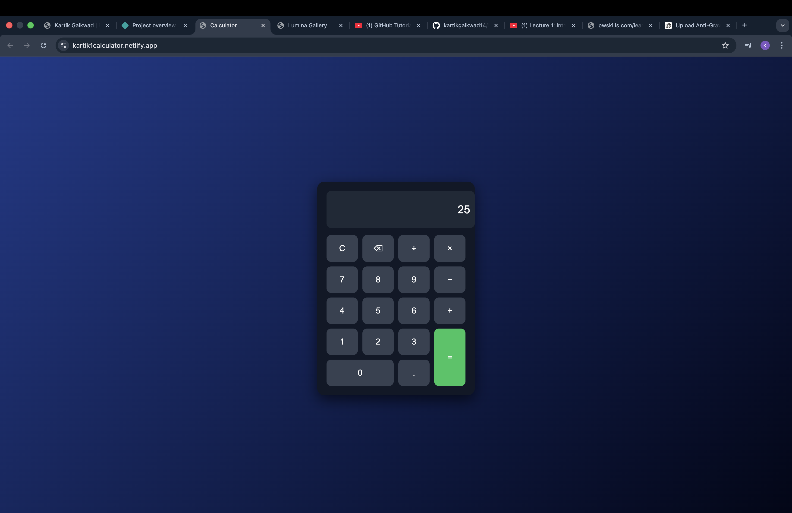

# Kartik Calculator

A modern and responsive **Web Calculator** built using **HTML, CSS, and JavaScript**.
It performs basic arithmetic operations with a clean UI and smooth interaction.

## 🌐 Live Website

https://kartik1calculator.netlify.app/

## 🚀 Features

* Basic arithmetic operations
* Responsive calculator design
* Clean and modern UI
* Fast calculations using JavaScript

## 🖼️ Project Screenshots

### Calculator Interface

### Input Example

### Calculation Result

## 🛠️ Technologies Used

* HTML
* CSS
* JavaScript

## 📂 Project Structure

calculator-project
│
├── index.html
├── style.css
├── script.js
└── README.md

## 👨‍💻 Author

Kartik Gaikwad
Computer Engineering Student
DY Patil Institute of Technology, Pimpri
